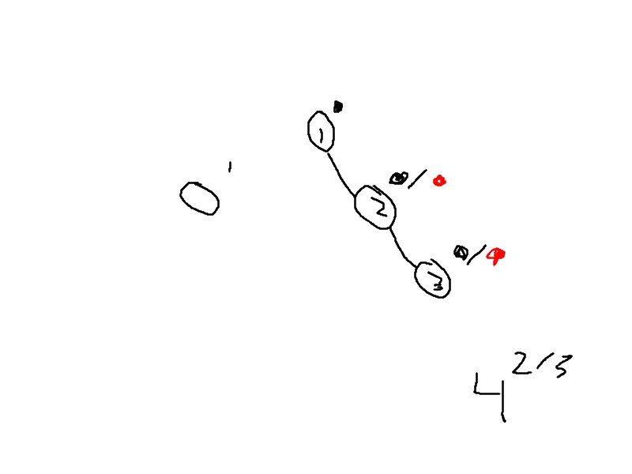

# Red Black Tree

## Invariants

1. Each node is red or black
2. Root node is black
3. No 2 reds in a row; Red node only has black children; Red node has a black parent
4. Every root-null path has the same number of black nodes.

## Height Guarantee

Every red-black tree with `n` nodes has height `<= 2 * log2(n+1)`

If every root-null path has `>= k` nodes, then tree includes a perfectly balanced search tree of depth `k - 1`
size `n` of te tree must be at least `2^(k) - 1`

* `n >= 2^(k) - 1`
* `k <= log2(n+1)`

In a red-black tree with n nodes, there is a root-null path, with at most `log2(n+1)` black nodes.

By rule 4: Every root-null path has `<= log2(n+1)` black nodes.
By rule 3: every root-null path has `<= 2 * log2(n+1)` total nodes.
### Examples

A chain can not be a red black tree:

